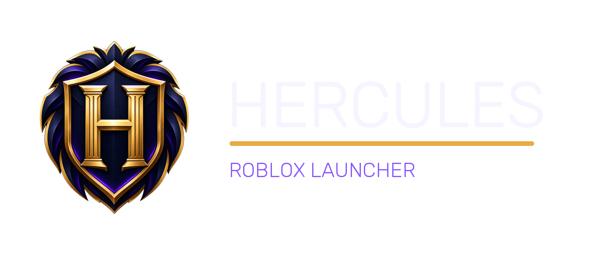

# Hercules



Hercules is a Windows launcher and configuration manager for Roblox. It manages Roblox installation, launch behavior, Fast Flags, mods, integrations, and desktop shortcuts without injecting code into the client.

## Requirements

- Windows 10 version 1809 or newer
- .NET 10 SDK to build from source
- Visual Studio 2022 with the .NET desktop workload (recommended)

## Build

```powershell
dotnet restore Hercules.sln
dotnet build Hercules.sln --configuration Release
```

To create the self-contained Windows x64 executable:

```powershell
dotnet publish Hercules/Hercules.csproj --configuration Release --runtime win-x64
```

Before publishing releases, replace `YOUR_GITHUB_OWNER` in `Hercules/App.xaml.cs` with the trusted GitHub owner. Automatic updates deliberately reject unverified assets and remain disabled while the placeholder is present.

## Project structure

- `Hercules/` — main WPF application
- `wpfui/` — vendored WPF UI dependency
- `Images/` — project artwork and screenshots
- `Scripts/` — repository maintenance utilities

## Security

Hercules does not inject cheats, exploits, or security bypasses. Release updates are accepted only over HTTPS, from the configured repository, with the exact `Hercules.exe` asset name and a GitHub-provided SHA-256 digest.

Please review [AUDIT.md](AUDIT.md) before publishing a release.

## Credits and license

Hercules is derived from [Voidstrap](https://github.com/voidstrap/Voidstrap), which is built on [Bloxstrap](https://github.com/bloxstraplabs/bloxstrap). Their attribution and license files are intentionally preserved.

The Hercules changes are available under the MIT license in [LICENSE.HERCULES](LICENSE.HERCULES). See the other `LICENSE.*` files for inherited components.
